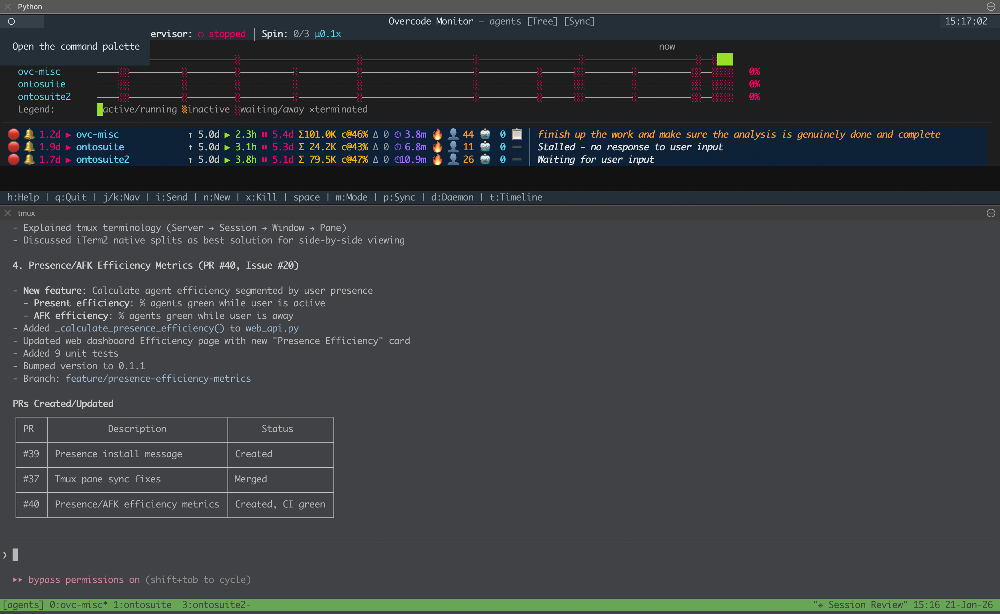
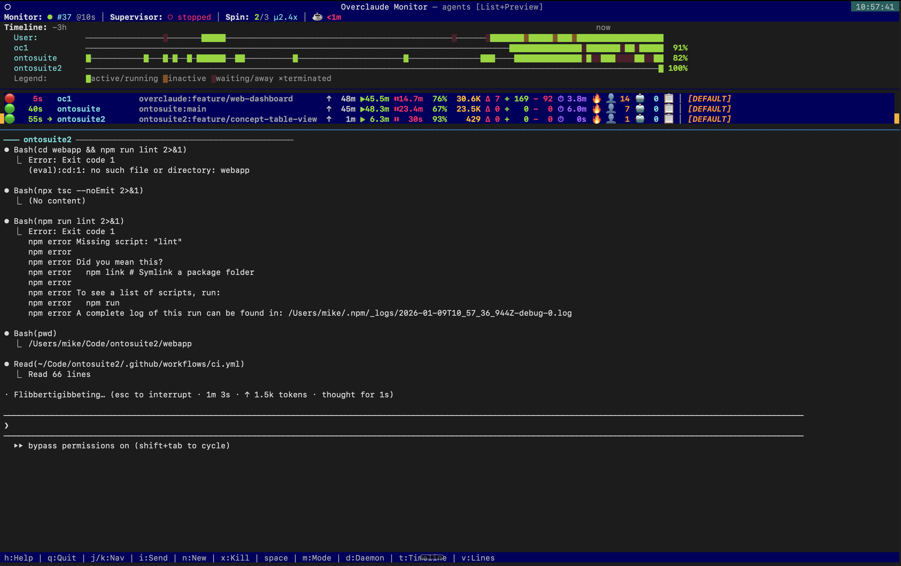

# overcode

A TUI supervisor for managing multiple Claude Code agents in tmux.

Launch autonomous coding agents, monitor their progress in real-time, track costs and activity, and coordinate work across your projects—all from a single dashboard.

## Why overcode?

Running multiple Claude Code agents is powerful, but managing them gets chaotic fast. Overcode solves this by giving you:

- **Unified visibility** - See all agents at a glance: what they're working on, whether they need input, and how much they're costing you
- **Smart orchestration** - An optional supervisor daemon can approve prompts and keep agents moving without constant attention
- **Efficiency metrics** - Track "green time" (Claude actively working) vs idle time to understand where time goes
- **Session persistence** - Agents run in tmux, surviving terminal disconnects. Pick up where you left off

## Screenshots

**Split-screen with tmux sync** - Monitor agents in the top pane while viewing live agent output below. Press `p` to enable pane sync, then navigate with `j/k` to switch the bottom pane to the selected agent's window.



> **iTerm2 setup**: Use `Cmd+Shift+D` to split horizontally. Run `overcode monitor` in the top pane and `tmux attach -t agents` in the bottom pane.

**Preview mode** - Press `m` to toggle List+Preview mode. Shows collapsed agent list with detailed terminal output preview for the selected agent.



## Quick Start

Try it instantly with [uvx](https://docs.astral.sh/uv/):

```bash
uvx overcode monitor
```

This opens the dashboard. Press `n` to create your first agent—give it a name, point it at a project directory, and optionally provide an initial prompt. Create a few agents to see them work in parallel.

**Requirements:** Python 3.12+, tmux, [Claude Code CLI](https://docs.anthropic.com/en/docs/claude-code)

For permanent installation: `pip install overcode`

See the [Getting Started Guide](docs/getting-started.md) for a complete walkthrough.

## Features

### Real-time Dashboard
The TUI displays all agents with live status updates, showing:
- Current activity and AI-generated summaries
- Status indicators (running/waiting/stalled)
- Cost and token usage per agent
- Git repo and branch information
- Timeline showing status history

### Agent Management
- **Launch agents** with custom prompts and permission settings
- **Send instructions** directly from the dashboard
- **Standing orders** - persistent instructions that guide agent behavior
- **Sleep mode** - pause agents and exclude them from stats
- **Priority sorting** - organize agents by importance

### Supervisor Daemon
An optional Claude-powered orchestrator that:
- Monitors agents for prompts requiring approval
- Automatically handles routine confirmations
- Follows per-agent standing orders
- Tracks interventions and steering decisions

### Analytics & Export
- **Web dashboard** - mobile-friendly monitoring from any device
- **Historical analytics** - browse session history with charts
- **Parquet export** - analyze data in Jupyter notebooks
- **Presence tracking** - correlate activity with your availability (macOS)

## TUI Controls

| Key | Action |
|-----|--------|
| `j/k` or `↑/↓` | Navigate agents |
| `Enter` | Approve/send Enter to agent |
| `i` or `:` | Send instruction |
| `m` | Toggle list+preview mode |
| `t` | Toggle timeline |
| `z` | Toggle sleep mode |
| `x` | Kill agent (double-press) |
| `b` | Jump to next agent needing attention |
| `h` or `?` | Show all shortcuts |
| `q` | Quit |

See the [TUI Guide](docs/tui-guide.md) for all keyboard shortcuts.

## Documentation

- [Getting Started](docs/getting-started.md) - Installation and first steps
- [CLI Reference](docs/cli-reference.md) - All commands and options
- [TUI Guide](docs/tui-guide.md) - Keyboard shortcuts and display modes
- [Configuration](docs/configuration.md) - Config file and environment variables
- [Advanced Features](docs/advanced-features.md) - Sleep mode, handover, remote monitoring

## License

MIT
