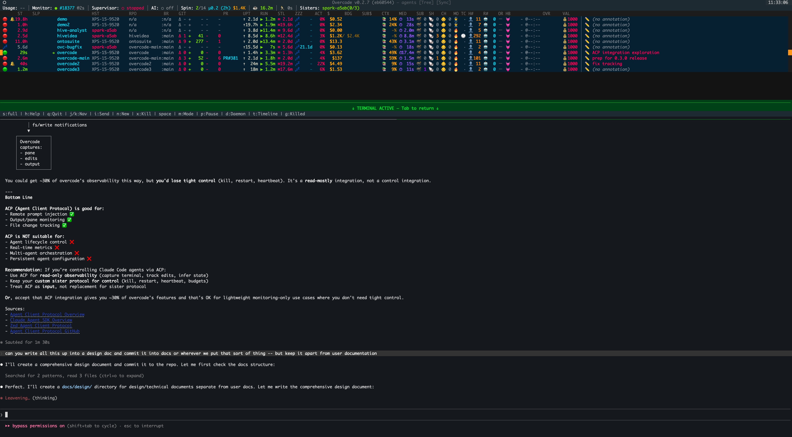

# overcode

A TUI supervisor for managing multiple Claude Code agents in tmux.

Launch autonomous coding agents, monitor their progress in real-time, track costs and activity, and coordinate work across your projects—all from a single dashboard.

## Why overcode?

Running multiple Claude Code agents is powerful, but managing them gets chaotic fast. Overcode solves this by giving you:

- **Unified visibility** - See all agents at a glance: what they're working on, whether they need input, and how much they're costing you
- **Native tmux integration** - A split layout with your dashboard on top and the focused agent's live terminal below—full speed, full color, full scrollback
- **Smart orchestration** - An optional supervisor daemon can approve prompts and keep agents moving without constant attention
- **Multi-machine monitoring** - Sister integration aggregates agents from multiple machines into one view
- **Session persistence** - Agents run in tmux, surviving terminal disconnects. Pick up where you left off

## Screenshot

**Tmux split layout** — Monitor all agents in the top pane. The bottom pane shows the selected agent's live terminal. Navigate with `j/k` and the bottom pane follows. Press `Tab` to switch focus between panes.



## Quick Start

Try it instantly with [uvx](https://docs.astral.sh/uv/):

```bash
uvx overcode monitor
```

This opens the standalone dashboard. Press `n` to create your first agent.

For the full tmux-native experience (recommended):

```bash
pip install overcode
overcode tmux
```

This creates a split layout: the overcode dashboard on top, the focused agent's live terminal on the bottom. Navigate agents with `j/k` — the bottom pane follows automatically. Press `Tab` to toggle focus between panes.

**Requirements:** Python 3.12+, tmux, [Claude Code CLI](https://docs.anthropic.com/en/docs/claude-code)

See the [Getting Started Guide](docs/getting-started.md) for a complete walkthrough.

## Features

### Tmux Split Layout (`overcode tmux`)
The recommended way to use overcode. Creates a two-pane layout in tmux:
- **Top pane**: Compact agent dashboard with live status
- **Bottom pane**: The focused agent's native terminal — no emulation, real tmux
- `j/k` navigates agents, bottom pane follows
- `Tab` toggles focus between dashboard and terminal
- `Option+J/K` navigates agents from the terminal pane
- `PageUp/Down` and mouse scroll work in the bottom pane

### Real-time Dashboard
The TUI displays all agents with live status updates, showing:
- Current activity and AI-generated summaries
- Status indicators (running/waiting/stalled)
- Cost and token usage per agent
- Git repo and branch information
- Timeline showing status history

### Agent Management
- **Launch agents** with custom prompts and permission settings
- **Send instructions** directly from the dashboard
- **Standing orders** - persistent instructions that guide agent behavior
- **Agent hierarchy** - parent/child delegation with follow mode and reporting
- **Cost budgets** - per-agent spending limits with automatic enforcement
- **Sleep mode** - pause agents and exclude them from stats

### Supervisor Daemon
An optional Claude-powered orchestrator that:
- Monitors agents for prompts requiring approval
- Automatically handles routine confirmations
- Follows per-agent standing orders
- Tracks interventions and steering decisions

### Wrappers
Run agents in custom environments — containers, VMs, or any setup your project needs:
- **Devcontainer wrapper** - Launch agents inside Docker containers with a single flag
- **Auto-install** - Bundled wrappers install themselves on first use
- **Customisable** - Write your own wrapper script or modify the bundled ones
- Set per-agent (`--wrapper devcontainer`) or as default in config

See the [Wrappers Guide](docs/wrappers.md) for setup and customisation.

### Sister Integration
Aggregate agents from multiple machines into one dashboard:
- Configure sister machines in `~/.overcode/config.yaml`
- Remote agents appear alongside local ones
- In tmux split mode, selecting a sister agent auto-zooms the dashboard with a preview pane

### Analytics & Export
- **Web dashboard** - mobile-friendly monitoring from any device
- **Historical analytics** - browse session history with charts
- **Parquet export** - analyze data in Jupyter notebooks
- **Presence tracking** - correlate activity with your availability

## TUI Controls

| Key | Action |
|-----|--------|
| `j/k` or `↑/↓` | Navigate agents |
| `Tab` | Toggle dashboard/terminal focus (tmux split) |
| `Enter` | Approve/send Enter to agent |
| `i` or `:` | Send instruction |
| `n` | Create new agent |
| `x` | Kill agent (double-press) |
| `b` | Jump to next agent needing attention |
| `h` or `?` | Show all shortcuts |
| `q` | Quit (or detach in tmux split) |

See the [TUI Guide](docs/tui-guide.md) for all keyboard shortcuts.

## Documentation

- [Getting Started](docs/getting-started.md) - Installation and first steps
- [CLI Reference](docs/cli-reference.md) - All commands and options
- [TUI Guide](docs/tui-guide.md) - Keyboard shortcuts and display modes
- [Configuration](docs/configuration.md) - Config file and environment variables
- [Wrappers](docs/wrappers.md) - Run agents in containers and custom environments
- [Advanced Features](docs/advanced-features.md) - Sleep mode, handover, remote monitoring

## License

MIT
